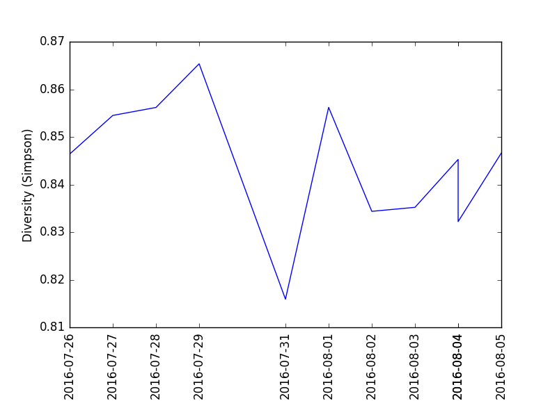

# Kombucha and the microbiome
This is a public data set for analyzing how a gut microbiome is affected by drinking kombucha.  You are welcome to study this as much as you like, provided you give your feedback. Contact me on Twitter (@sprague) or update the [Wiki associated with this repository](https://github.com/richardsprague/kombucha/wiki).

# Experiment
For seven days, from July 27 to August 2, 2016, I drank 48 ounces per day of commercially-purchased kombucha. I tested my gut microbiome with a uBiome Explorer kit each day, as well as my mouth and skin microbiome at intervals during the experiment.

The results of each uBiome Explorer test are in the [data](./data) directory in a series of JSON-formatted files.

# About me
I am a 50-year-old male in excellent health. I am 6 feet tall and weigh 160 pounds, take no prescription drugs, have never smoked tobacco, and live a reasonably active lifestyle. My appendix was removed as a child.

# Food diary
This data set also includes a complete list of all the foods I consumed between July 26th (the day before the experiment) and August 5th (several days afterwards). As you will see, I am an omnivore who eats a variety of foods, including coffee, dairy, wheat, meat, fish, and some alcohol.

# Study the data in Python

If you have the [uBiome open source python library](https://github.com/ubiome-opensource/microbiome-tools/tree/master/ubiome), the enclosed Python script [kombucha-analysis.py](.kombucha-analysis.py) will read the uBiome JSON results files into a variable for further analysis, and plot the diversity like this:

